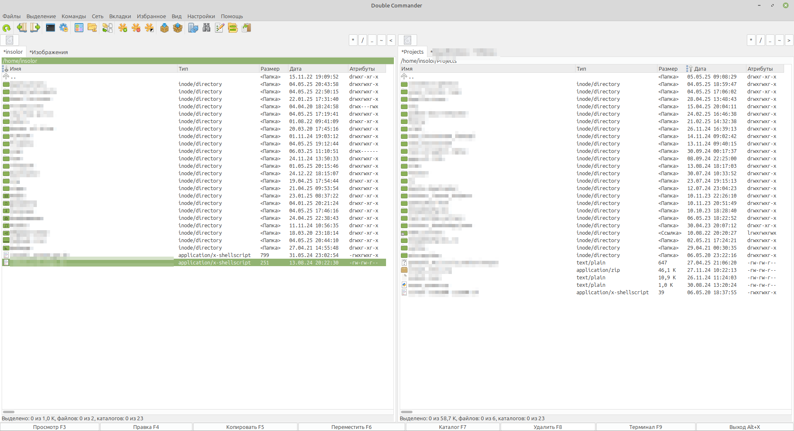

# My Double Commander configs

- UI tweaked (see the screenshot below)
- Extension is shown as a part of filename. File type column shows mime type.
- Recently modified files are highlited with green color.
- Left/Right keyboard buttons place focus to command line (which is hidden by default)
- Terminal button the toolbar opens ghosstty with the active panel as working directory
  - Other ways to open a terminal open the standard system terminal instead (because there's no way to run a specified command in ghossty, afaik)

